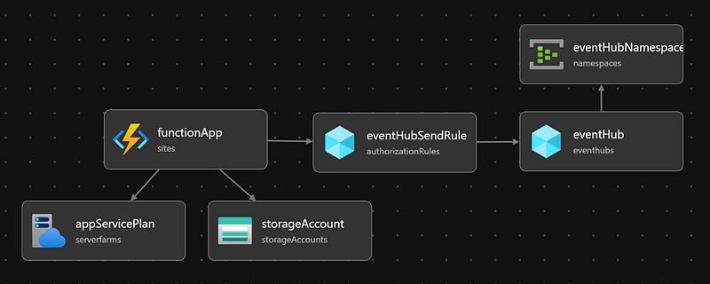

# Telemetry Data Generator

This is a simple telemetry generator that can be used to generate telemetry data for testing purposes. It was built for the Azure Data Explorer Microhack as a replacement for the IoT Central dependency.

## Read the Blog

This repository accompanies my blog post on Medium titled _[Build your own Telemetry Data Generator to Simulate IoT and OT Devices](https://medium.com/@olafwrieden/build-your-own-telemetry-data-generator-to-simulate-iot-and-ot-devices-43eaa954f1f8)_ which it walks you through customising this generator to suit the unique shape of your data - this way you can mimic your real-world data in a test environment.

[](https://medium.com/@olafwrieden/build-your-own-telemetry-data-generator-to-simulate-iot-and-ot-devices-43eaa954f1f8)

## Deploy to Azure

To deploy this generator to Azure, click the button below. You will need an Azure Subscription and permission to create the resources shown in the image.

[](https://portal.azure.com/#create/Microsoft.Template/uri/https%3A%2F%2Fraw.githubusercontent.com%2Folafwrieden%2Ftelemetry-data-generator%2Fmain%2Finfra%2Fmain.json)



## How it works

The generator simulates telemetry from 30 devices whose ids are defined in the [`src/deviceIds.ts`](/src/deviceIds.ts) file. We want the generator to emit payloads for the same simulated devices each time, thus we hardcode the device ids to keep them consistent between runs.

Every 1 minute, the [`src/functions/TelemetryGenerator.ts`](src/functions/TelemetryGenerator.ts) runs and emits a payload for each device ID. The payload is a JSON object which matches the expected format for the IoT Central API.

The payload array is then written onto the Event Hub for later ingestion into a KQL Database (or other downstream system).

## How to use

To adjust the Event Hub name and connection string, edit the [`src/functions/TelemetryGenerator.ts`](src/functions/TelemetryGenerator.ts) file. Here you can also adjust the frequency of the payload generation.

```typescript
...
// Schedule the function to run every minute and push into the iotdata Event Hub.
app.timer("TelemetryGenerator", {
  schedule: "0 */1 * * * *",
  handler: TelemetryGenerator,
  return: output.eventHub({
    eventHubName: "iotdata", // <-- Name of the Azure Event Hub
    connection: "EventHubConnection", // <-- Environment variable (connection string)
  }),
});
```

Be sure to supply the `EventHubConnection` environment variable when deploying the function app. The value is the connection string of your Azure Event Hubs Namespace.

### In Development

Locally this can be supplied in a `local.settings.json` file like so:

```json
{
  "IsEncrypted": false,
  "Values": {
    "AzureWebJobsStorage": "DefaultEndpointsProtocol=...",
    "FUNCTIONS_WORKER_RUNTIME": "node",
    "AzureWebJobsFeatureFlags": "EnableWorkerIndexing",
    "EventHubConnection": "Endpoint=sb://..."
  }
}
```

### In Production

Add the `EventHubConnection` environment variable in the Azure Function's Configuration settings. The value should be the Azure Event Hub connection string, e.g.

| Key                  | Value               |
| -------------------- | ------------------- |
| `EventHubConnection` | `Endpoint=sb://...` |
